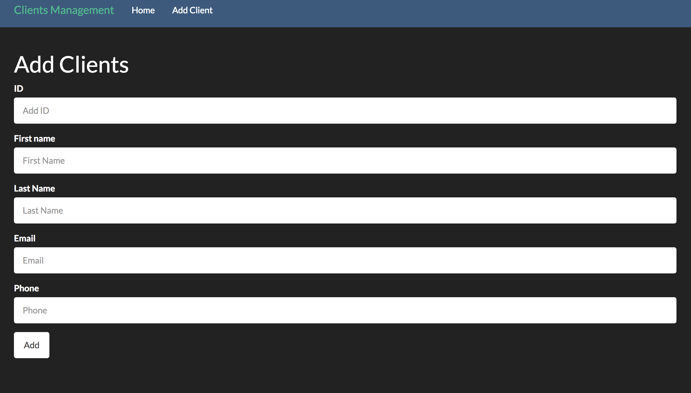
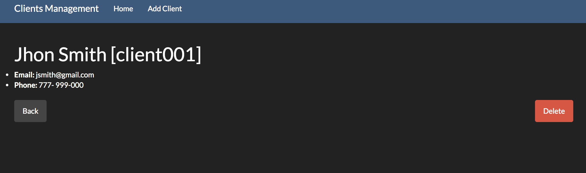

# REST API, Node and Redis Tutorial

Simple tutorial to create a simple bootstrap website front end and a Node JS server with REST API's for clients search,
show details and delete. In the back end is using a redis server conection to save clients details. To run the file it
will be necessary to install Node JS dependencies for redis, and for front end boostrap styles and classes. Also it is
necessary to run a redis server.
Keywords : NODE JS, BOOSTRAP, REDIS, REST API's.

### Add clients

### Clients details

